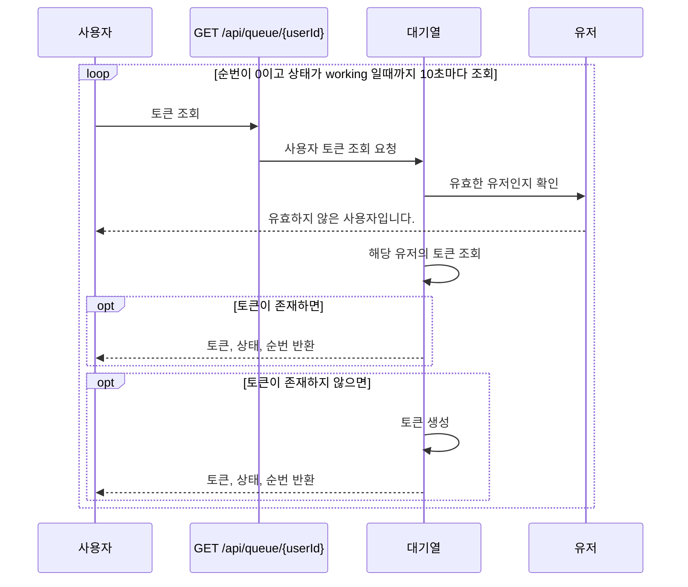
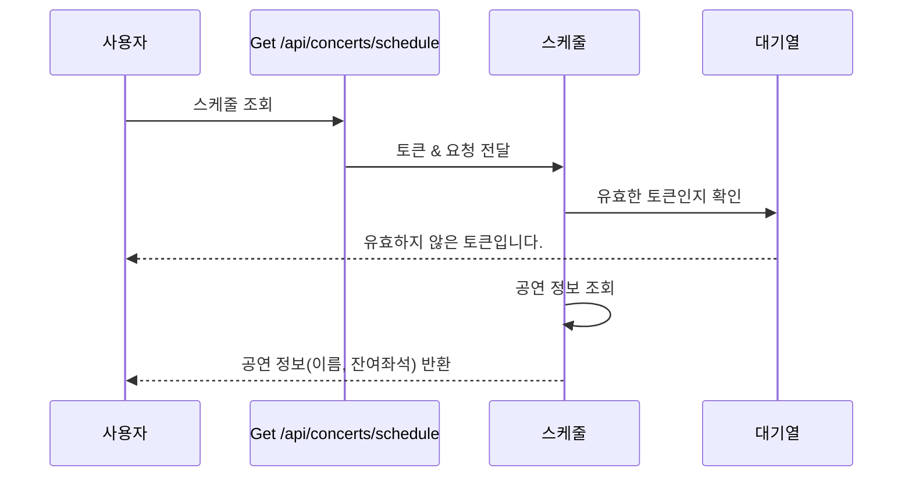
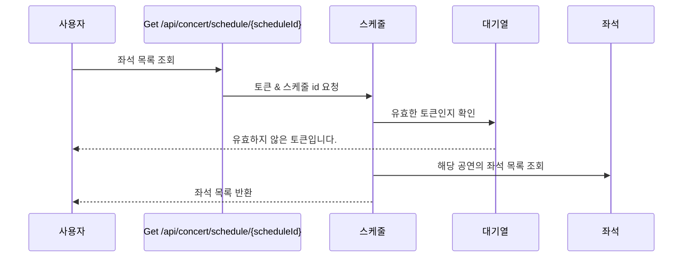
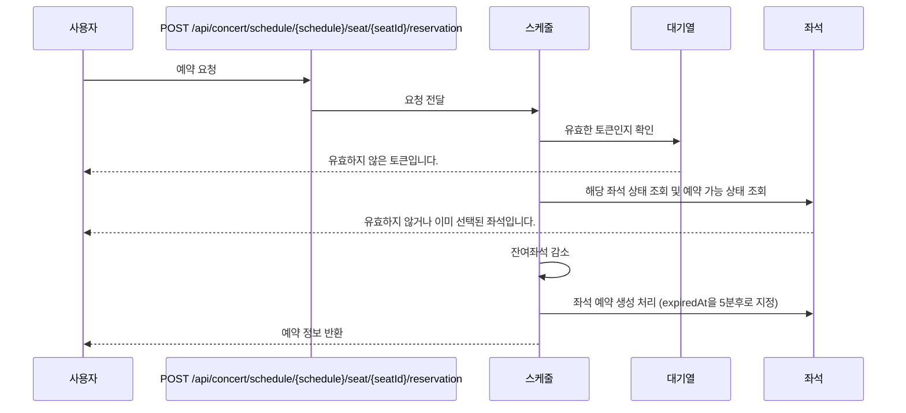
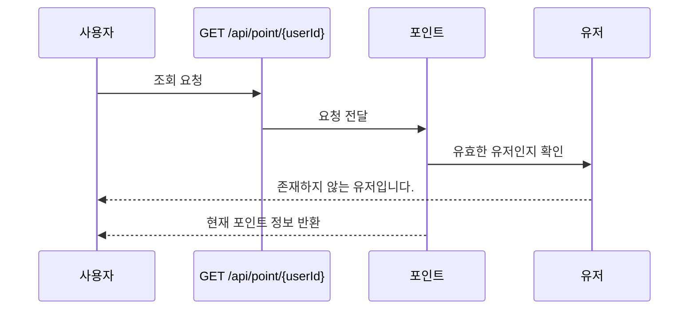
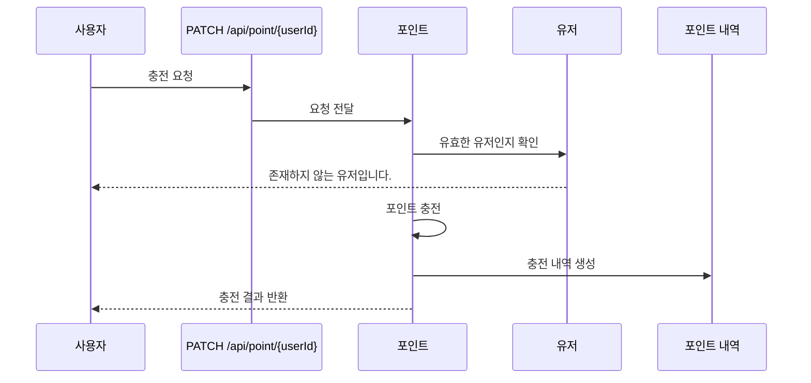
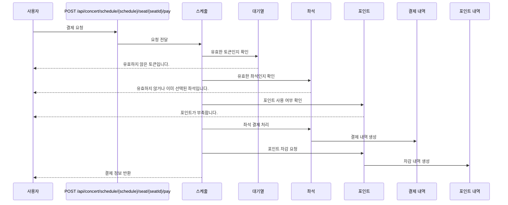
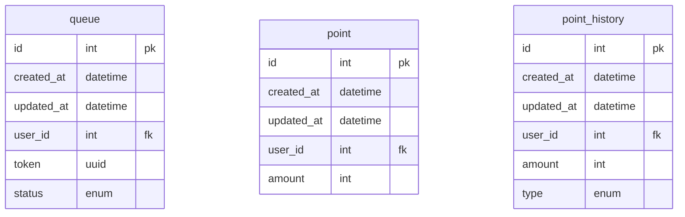
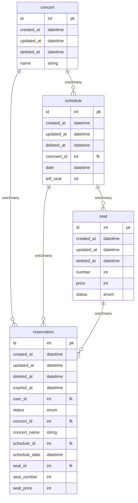

# Concert-Reservation-API

포인트를 충전하고 콘서트의 좌석을 예매하는 API

## 목차

- [Milestone](https://github.com/Ksanbal/Concert-Reservation-API/milestones)
- [Projects](https://github.com/users/Ksanbal/projects/8/views/1)
- [시퀀스 다이어그램](#시퀀스-다이어그램)
  - [유저 토큰 발급](#유저-토큰-발급)
  - [예약가능 날짜 조회](#예약가능날짜-조회)
  - [예약가능 날짜 조회](#예약가능-날짜-조회)
  - [예약가능 자리 조회](#예약가능-자리-조회)
  - [포인트 잔액 조회](#포인트-잔액-조회)
  - [포인트 충전](#포인트-충전)
  - [결제](#결제)
- [ERD](#erd)

## 시퀀스 다이어그램

### 유저 토큰 발급

### 예약가능 날짜 조회

### 예약가능 자리 조회

### 좌석 예약 요청

### 포인트 잔액 조회

### 포인트 충전

### 결제

## ERD

| Table         | Verbose     | Description                |
| ------------- | ----------- | -------------------------- |
| queue         | 대기열      | 사용자의 대기열 토큰 정보  |
| point         | 포인트      | 사용자의 포인트 정보       |
| point_history | 포인트 내역 | 포인트 충전, 사용 내역     |
| concert       | 공연        |                            |
| schedule      | 공연 스케줄 | 공연 날짜 및 잔여좌석 정보 |
| seat          | 공연 좌석   | 공연 스케줄의 좌석 정보    |
| reservation   | 예약        | 사용자의 공연 예약 정보    |

