# Concert-Reservation-API

포인트를 충전하고 콘서트의 좌석을 예매하는 API

## 목차

- [Milestone](https://github.com/Ksanbal/Concert-Reservation-API/milestones)
- [Projects](https://github.com/users/Ksanbal/projects/8/views/1)
- [시퀀스 다이어그램](#시퀀스-다이어그램)
  - [유저 토큰 발급](#유저-토큰-발급)
  - [예약가능 날짜 조회](#예약가능날짜-조회)
  - [예약가능 날짜 조회](#예약가능-날짜-조회)
  - [예약가능 자리 조회](#예약가능-자리-조회)
  - [포인트 잔액 조회](#포인트-잔액-조회)
  - [포인트 충전](#포인트-충전)
  - [결제](#결제)
- [ERD](#erd)
- [API 명세서](#api-명세서)

## 시퀀스 다이어그램

### 대기열

#### 대기열 토큰 발급

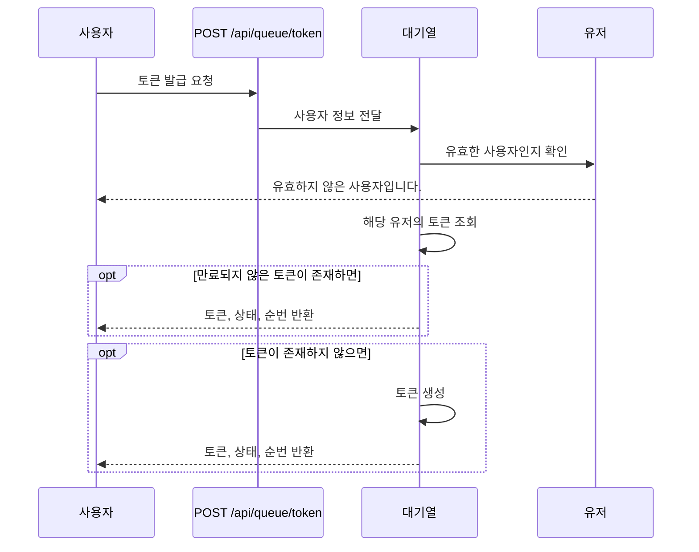

#### 대기열 토큰 유효성 체크

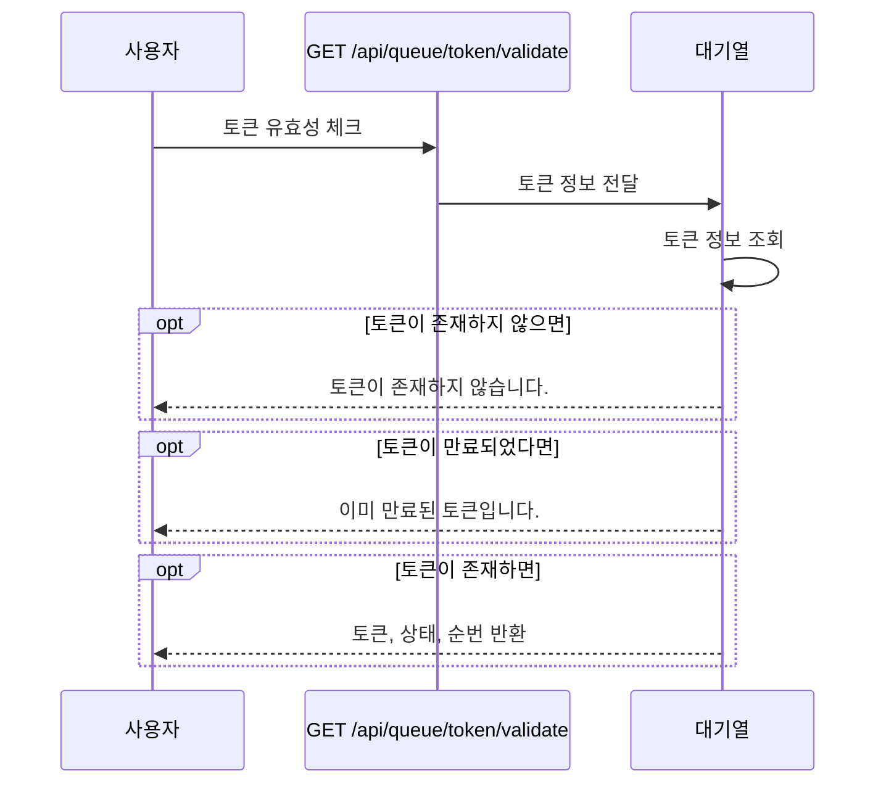

#### 대기열 토큰 유효기간 연장

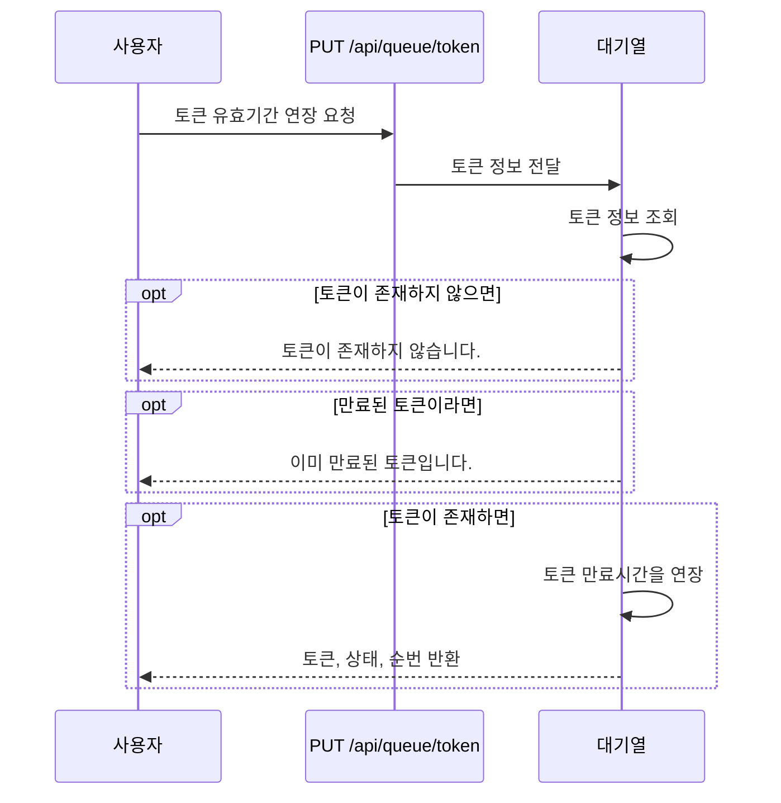

#### 대기열 토큰 삭제

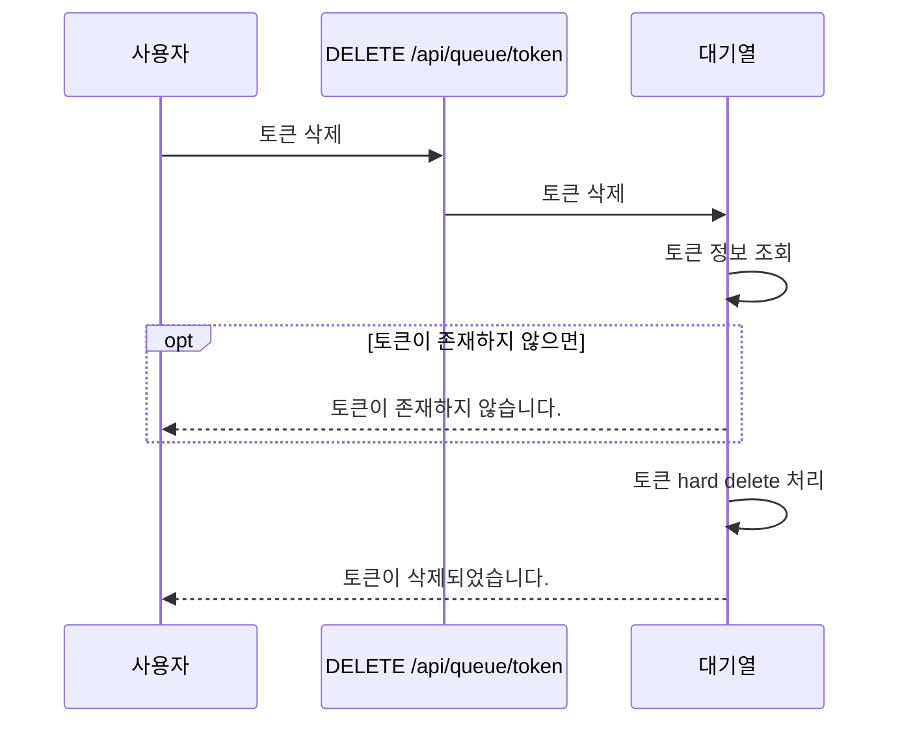

#### 대기열 토큰 상태 및 만료시간 업데이트 스케줄

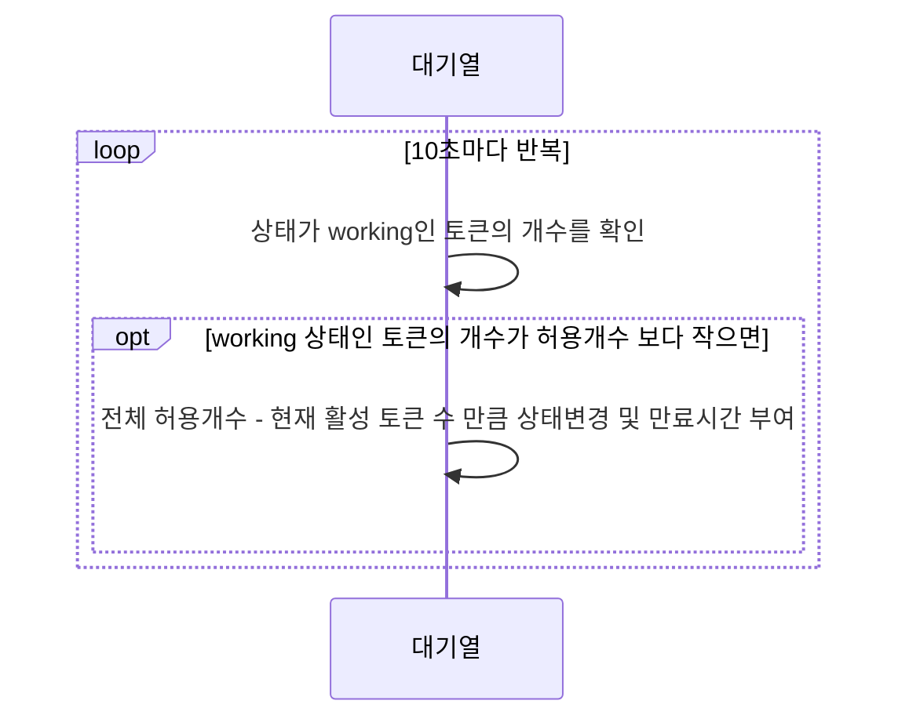

### 공연

#### 예약가능 날짜 조회

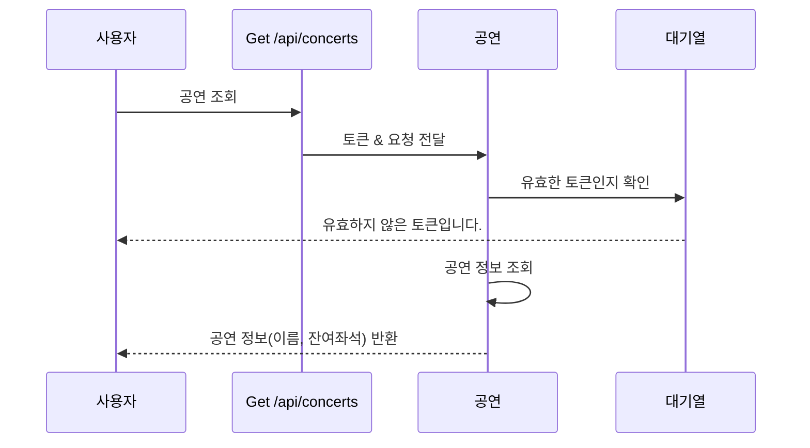

#### 예약가능 자리 조회

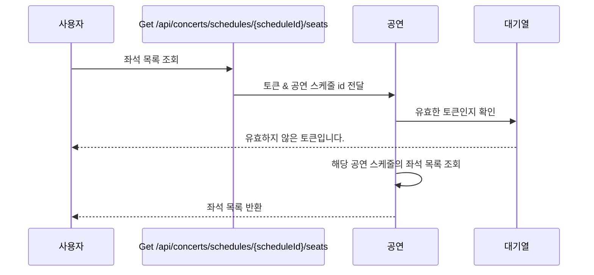

#### 좌석 예약 요청

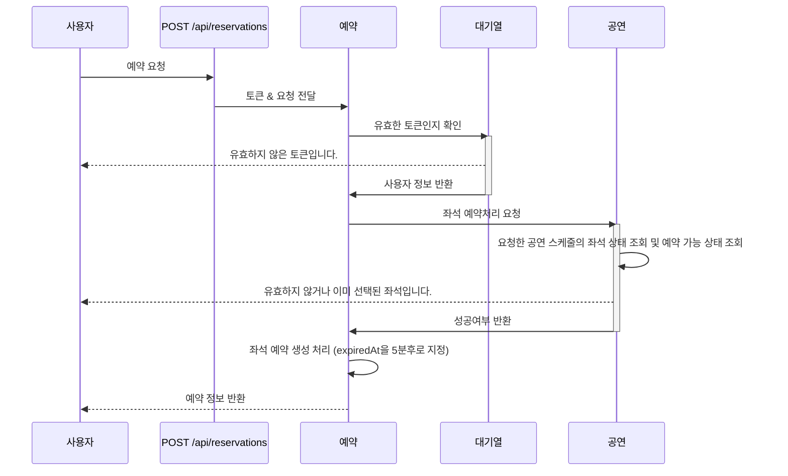

#### 좌석 예약 반환 스케줄

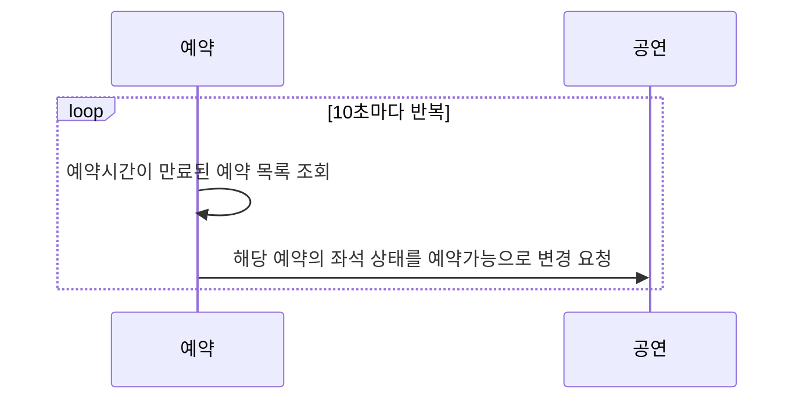

### 결제

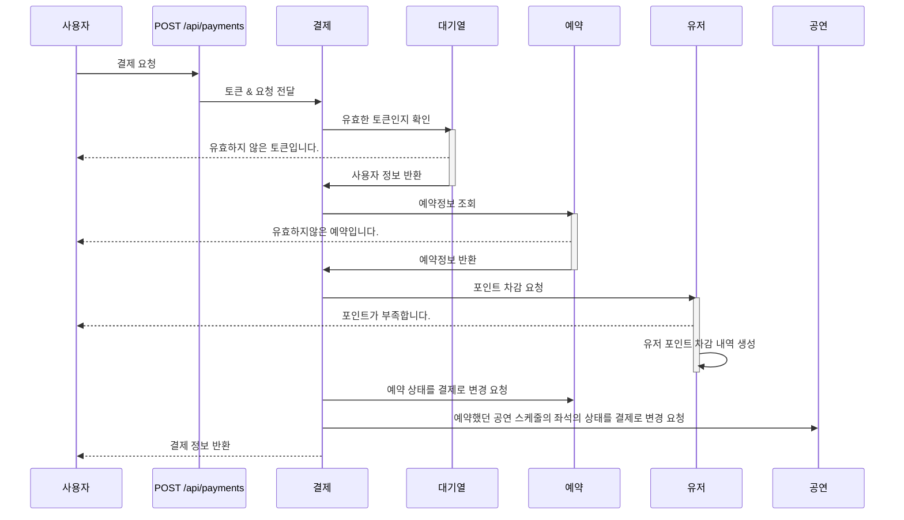

### 포인트

#### 포인트 잔액 조회

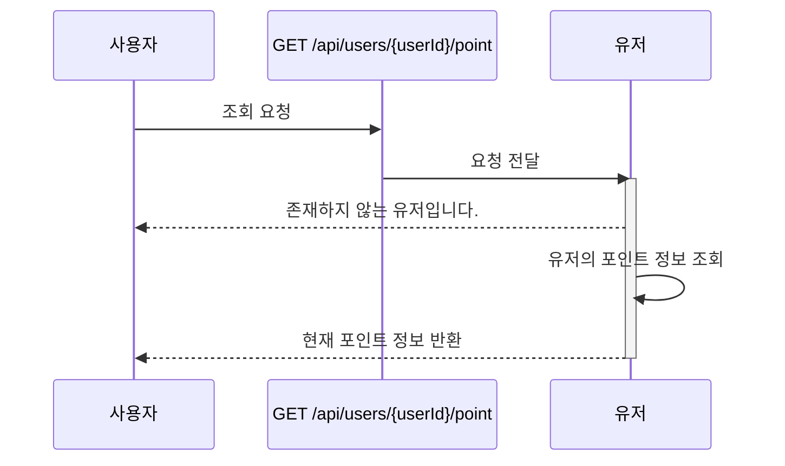

#### 포인트 충전

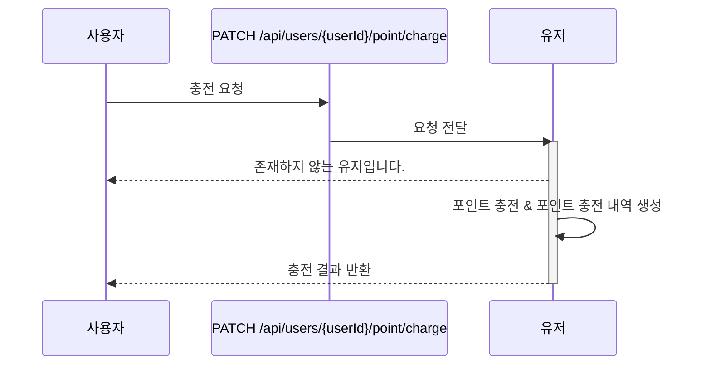

## ERD

| Table         | Verbose     | Description                |
| ------------- | ----------- | -------------------------- |
| queue         | 대기열      | 사용자의 대기열 토큰 정보  |
| point         | 포인트      | 사용자의 포인트 정보       |
| point_history | 포인트 내역 | 포인트 충전, 사용 내역     |
| concert       | 공연        |                            |
| schedule      | 공연 스케줄 | 공연 날짜 및 잔여좌석 정보 |
| seat          | 공연 좌석   | 공연 스케줄의 좌석 정보    |
| reservation   | 예약        | 사용자의 공연 예약 정보    |

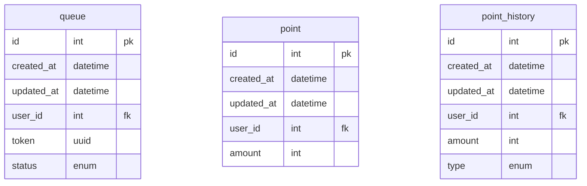

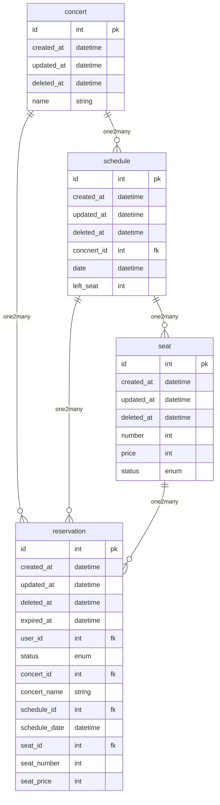

## API 명세서

**목차**

- [대기열 토큰 발급 및 조회](#대기열-토큰-발급-및-조회)
- [공연 날짜 조회](#공연-날짜-조회)
- [공연 좌석 조회](#공연-좌석-조회)
- [공연 예약](#공연-예약)
- [공연 결제](#공연-결제)
- [포인트 조회](#포인트-조회)
- [포인트 충전](#포인트-충전-1)

### 대기열 토큰 발급 및 조회

현재 유저의 대기열 정보를 조회합니다.

- `GET /api/queue/:userId`
- **Path Parameter**
  | Key | Description |
  | ------ | ----------- |
  | userId | 사용자 id |
- **Response**
  ```json
  // 200 OK
  {
    "token": "d07edb0f-3ac1-45a3-8972-7d263958b59d", // uuid
    "status": "wait", // wait, working
    "remain": 1
  }
  ```

### 공연 날짜 조회

공연 목록을 조회합니다.

- `GET /api/concert`
- **Header**
  | Key | Description |
  | ------ | ----------- |
  | Authorization | 대기열 토큰 |
- **Response**

  ```json
  // 200 OK
  [
    {
      "id": 1,
      "name": "카리나의 왁자지껄",
      "created_at": "2023-04-12T14:30:00+09:00",
      "schedule": [
        {
          "id": 1,
          "date": "2023-04-12T14:30:00+09:00",
          "left_seat": 50,
        }
      ]
    }
  ]

  // 401 Unauthorized
  {
    "message": "유효하지 않은 토큰입니다."
  }

  // 403 Forbidden
  {
    "message": "유효하지 않은 토큰입니다."
  }
  ```

### 공연 좌석 조회

해당 공연의 좌석 목록을 조회합니다.

- `GET /api/concert/schedule/:scheduleId`
- **Header**
  | Key | Description |
  | ------ | ----------- |
  | Authorization | 대기열 토큰 |
- **Path Parameter**
  | Key | Description |
  | ------ | ----------- |
  | scheduleId | 공연 스케줄 id |
- **Response**

  ```json
  // 200 OK
  [
    {
      "id": 1,
      "number": 1,
      "price": 50000,
      "status": "Available" // Available, Reserved, Purchased
    }
  ]

  // 401 Unauthorized
  {
    "message": "유효하지 않은 토큰입니다."
  }

  // 403 Forbidden
  {
    "message": "유효하지 않은 토큰입니다."
  }
  ```

### 공연 예약

공연을 예약합니다.

- `POST /api/concert/schedule/reservation`
- **Header**
  | Key | Description |
  | ------ | ----------- |
  | Authorization | 대기열 토큰 |
- **Request Body**
  | Key | Type | Description |
  | ------ | ----------- |-|
  | scheduleId | int | 공연 날짜 id |
  | seatId | int | 좌석 id |
  ```json
  {
    "scheduleId": 1,
    "seatId": 1
  }
  ```
- **Response**

  ```json
  // 201 Created
  {
    "id": 1
  }

  // 400 Bad Request
  {
    "message": "이미 선택된 좌석입니다."
  }

  // 401 Unauthorized
  {
    "message": "유효하지 않은 토큰입니다."
  }

  // 403 Forbidden
  {
    "message": "유효하지 않은 토큰입니다."
  }
  ```

### 공연 결제

사용자가 예약한 공연을 결제합니다.

- `PATCH /api/concert/schedule/reservation/:reservationId`
- **Header**
  | Key | Description |
  | ------ | ----------- |
  | Authorization | 대기열 토큰 |
- **Path Parameter**
  | Key | Description |
  | ------ | ----------- |
  | reservationId | 예약 id |
- **Response**

  ```json
  // 200 Ok
  {
    "id": 1
  }

  // 400 Bad Request
  {
    "message": "포인트가 부족합니다."
  }

  {
    "message": "유효하지 않은 접근입니다."
  }

  // 401 Unauthorized
  {
    "message": "유효하지 않은 토큰입니다."
  }

  // 403 Forbidden
  {
    "message": "유효하지 않은 토큰입니다."
  }
  ```

### 포인트 조회

현재 유저의 포인트 정보를 조회합니다.

- `GET /api/point/:userId`
- **Path Parameter**
  | Key | Description |
  | ------ | ----------- |
  | userId | 사용자 id |
- **Response**
  ```json
  // 200 Ok
  {
    "amount": 100000
  }
  ```

### 포인트 충전

현재 유저의 포인트를 충전합니다.

- `PATCH /api/point/:userId`
- **Path Parameter**
  | Key | Description |
  | ------ | ----------- |
  | userId | 사용자 id |
- **Request Body**
  | Key | Type | Description |
  | ------ | ----------- |-|
  | amount | int | 충전 금액 |
  ```json
  {
    "amount": 50000
  }
  ```
- **Response**

  ```json
  // 200 Ok
  ```
