# Concert-Reservation-API

포인트를 충전하고 콘서트의 좌석을 예매하는 API

## 목차

- [Milestone](https://github.com/Ksanbal/Concert-Reservation-API/milestones)
- [Projects](https://github.com/users/Ksanbal/projects/8/views/1)
- [시퀀스 다이어그램](#시퀀스-다이어그램)
  - [대기열](#대기열)
    - [대기열 토큰 발급](#대기열-토큰-발급)
    - [대기열 토큰 유효성 체크](#대기열-토큰-유효성-체크)
    - [대기열 토큰 유효기간 연장](#대기열-토큰-유효기간-연장)
    - [대기열 토큰 상태 및 만료시간 업데이트 스케줄](#대기열-토큰-상태-및-만료시간-업데이트-스케줄)
  - [공연](#공연)
    - [예약가능 날짜 조회](#예약가능-날짜-조회)
    - [예약가능 자리 조회](#예약가능-자리-조회)
    - [공연 예약 요청](#공연-예약-요청)
    - [좌석 예약 반환 스케줄](#좌석-예약-반환-스케줄)
  - [결제](#결제)
  - [포인트](#포인트)
    - [포인트 잔액 조회](#포인트-잔액-조회)
    - [포인트 충전](#포인트-충전)
- [ERD](#erd)
- [API 명세서](#api-명세서)
- [Query 분석 및 캐싱 전략 설계](#query-분석-및-캐싱-전략-설계)
- [수행되는 쿼리 수집과 인덱스를 통한 성능개선](#수행되는-쿼리-수집과-인덱스를-통한-성능개선)
- [트랜잭션 범위의 이해와 MSA로 분리시 트랜잭션 처리의 한계와 해결방안](#트랜잭션-범위의-이해와-msa로-분리시-트랜잭션-처리의-한계와-해결방안)

## 시퀀스 다이어그램

### 대기열

#### 대기열 토큰 발급

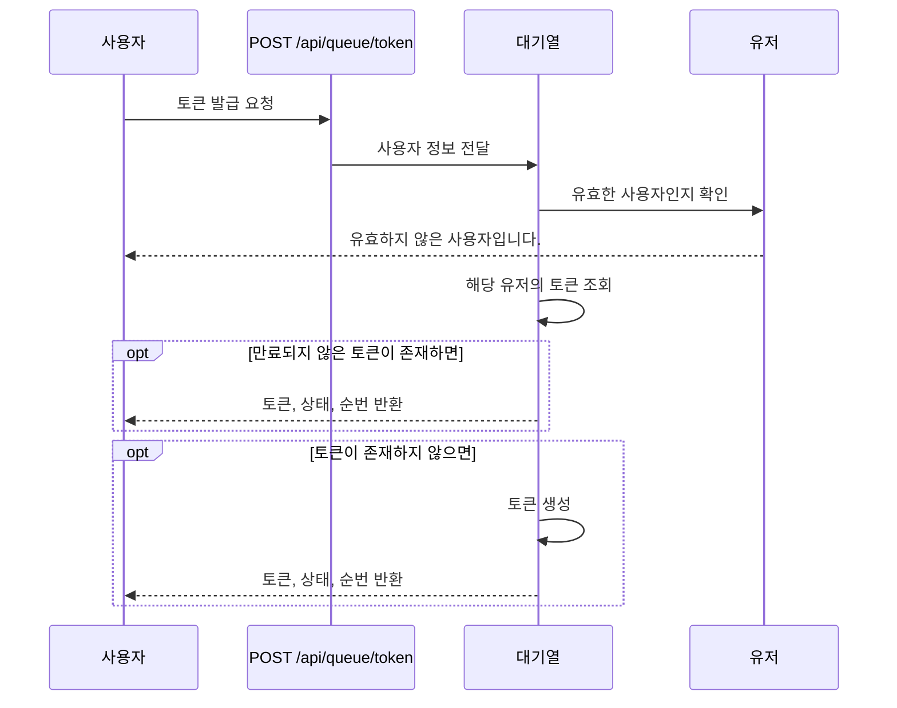

#### 대기열 토큰 유효성 체크

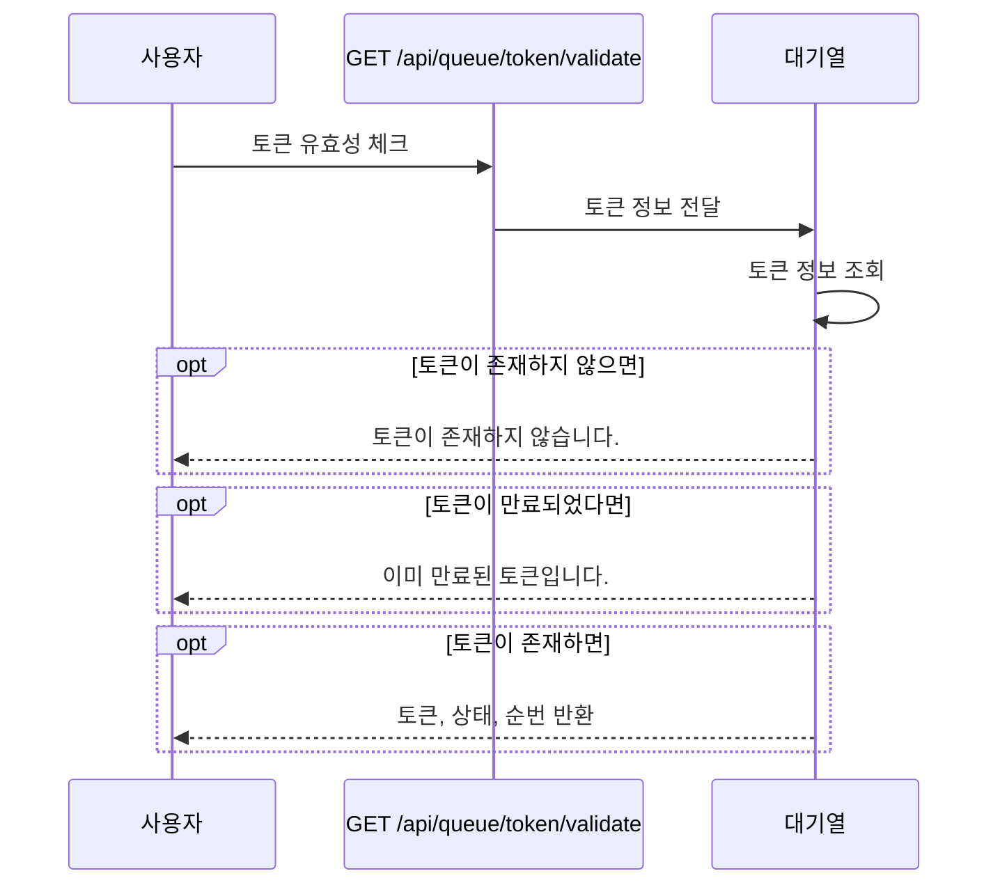

#### 대기열 토큰 유효기간 연장

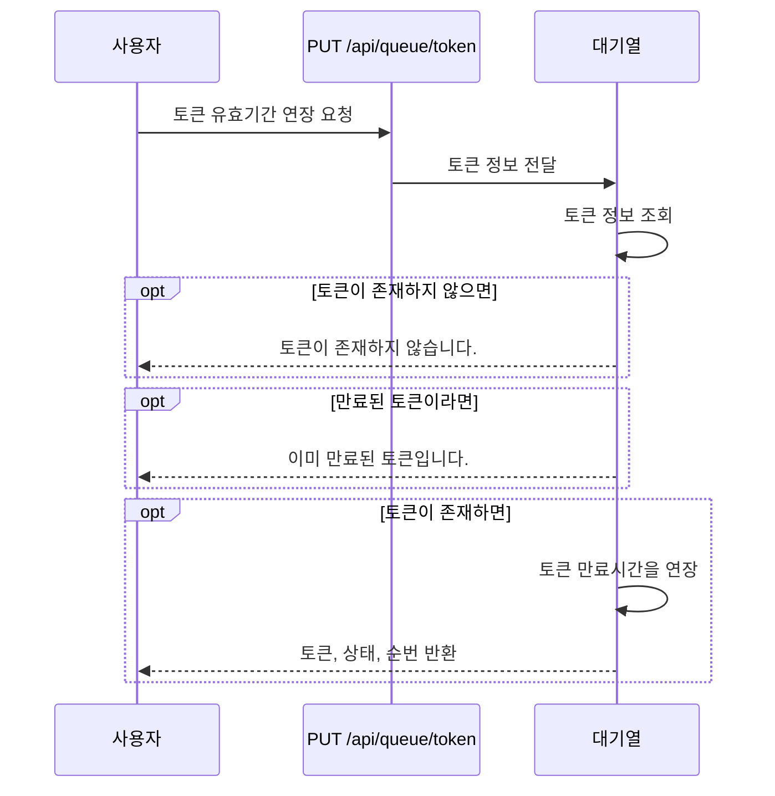

#### 대기열 토큰 상태 및 만료시간 업데이트 스케줄

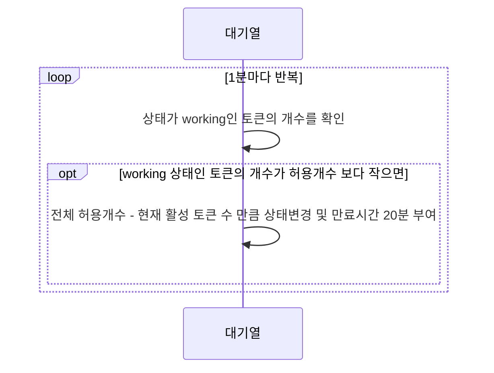

### 공연

#### 예약가능 날짜 조회

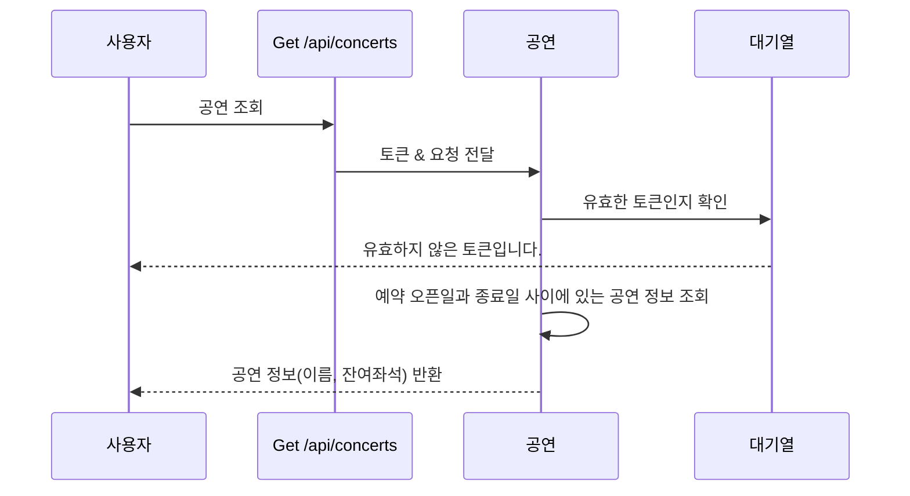

#### 예약가능 자리 조회

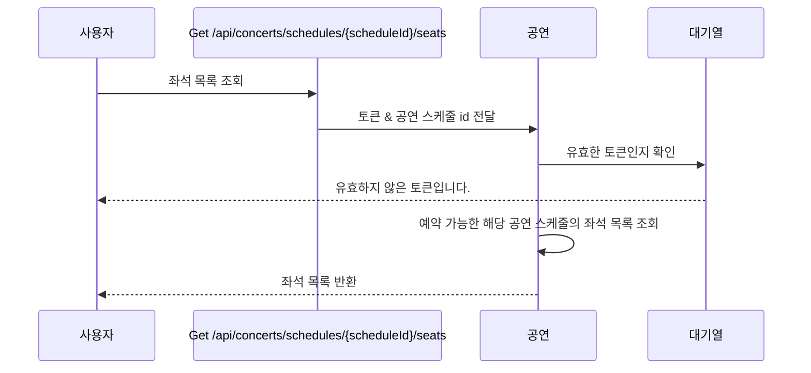

#### 공연 예약 요청

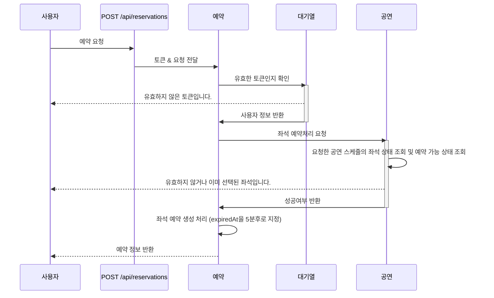

#### 좌석 예약 반환 스케줄


### 결제

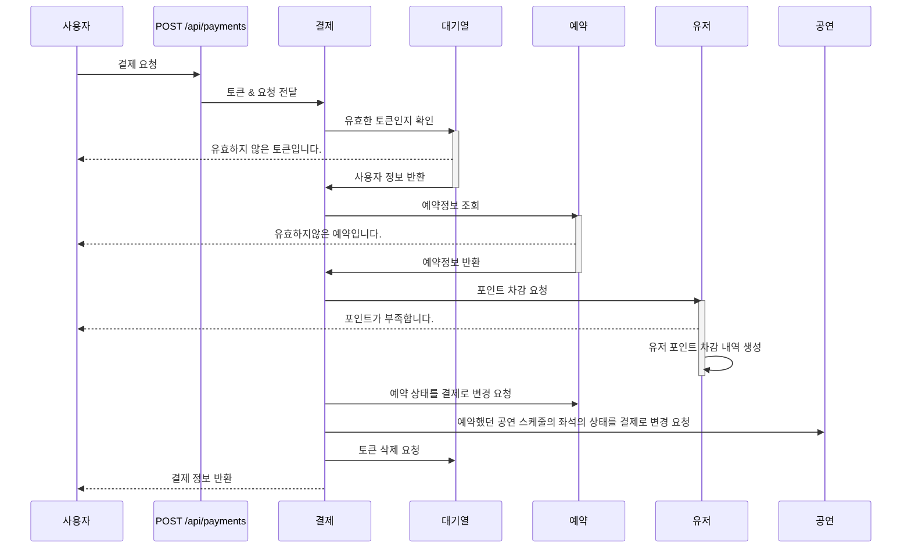

### 포인트

#### 포인트 잔액 조회

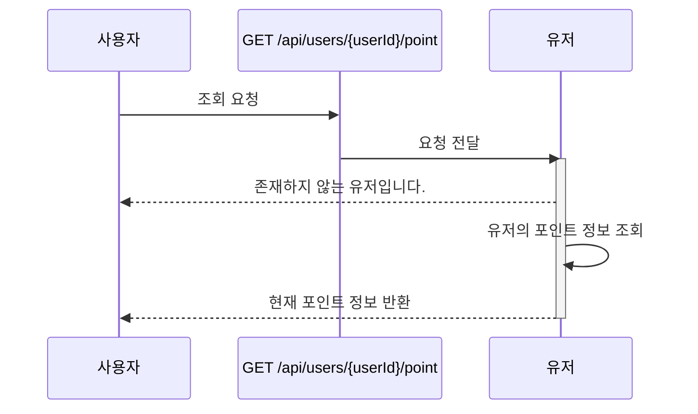

#### 포인트 충전

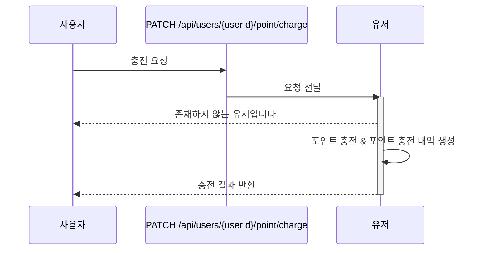

## ERD

| Table             | Verbose         | Description                         |
| ----------------- | --------------- | ----------------------------------- |
| user              | 사용자          | 사용자                              |
| queue             | 대기열          | 사용자의 대기열 토큰 정보           |
| point             | 포인트          | 사용자의 포인트 정보                |
| point_history     | 포인트 내역     | 포인트 충전, 사용 내역              |
| concert           | 공연            |                                     |
| concert_schedule  | 공연 스케줄     | 공연 날짜 및 잔여좌석 정보          |
| concert_seat      | 공연 좌석       | 공연 스케줄의 좌석 정보             |
| reservation       | 예약            | 사용자의 공연 예약 정보             |
| payment           | 결제정보        | 사용자의 공연 예약 정보             |
| concert_meta_data | 공연 메타데이터 | 공연 예약시 생성되는 공연 meta data |

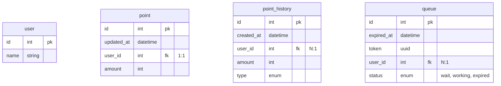

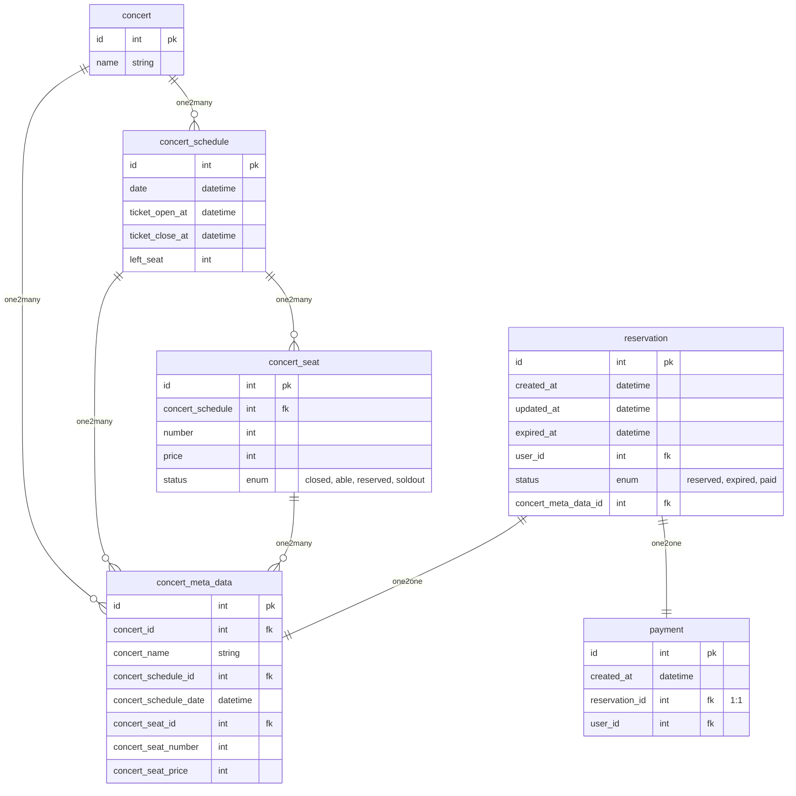

## API 명세서

**목차**

- 대기열
  - [대기열 토큰 발급](#대기열-토큰-발급-api)
  - [대기열 토큰 유효성 체크](#대기열-토큰-유효성-체크-api)
  - [대기열 토큰 유효기간 연장](#대기열-토큰-유효기간-연장-api)
- 공연
  - [예약 가능한 공연 날짜 조회](#예약-가능한-공연-날짜-조회-api)
  - [공연 좌석 조회](#공연-좌석-조회-api)
  - [공연 예약](#공연-예약-api)
- [공연 결제](#공연-결제-api)
- 포인트
  - [포인트 조회](#포인트-조회-api)
  - [포인트 충전](#포인트-충전-api)

### 대기열 토큰 발급 API

현재 유저에게 대기열 토큰을 발급합니다.

- `POST /api/queue/token`
- **Body**
  |Key|type|Description|
  |---|---|---|
  |userId|int|사용자 id|
- **Response**

  ```json
  // 201 Created
  {
    "token": "d07edb0f-3ac1-45a3-8972-7d263958b59d", // uuid
    "status": "wait", // wait, working
    "remain": 1
  }

  // 401 Unauthorized
  {
    "message": "유효하지 않은 사용자입니다."
  }
  ```

### 대기열 토큰 유효성 체크 API

현재 유저의 대기열 정보를 조회합니다.

- `GET /api/queue/token/validate`
- **Header**
  | Key | Description |
  | ------ | ----------- |
  | Authorization | 대기열 토큰 |
- **Response**

  ```json
  // 200 OK
  {
    "token": "d07edb0f-3ac1-45a3-8972-7d263958b59d", // uuid
    "status": "wait", // wait, working
    "remain": 1
  }

  // 404 Not Found
  {
    "message": "토큰이 존재하지 않습니다."
  }

  // 401 Unauthorized
  {
    "message": "이미 만료된 토큰입니다."
  }
  ```

### 대기열 토큰 유효기간 연장 API

현재 유저의 대기열 토큰의 유효기간을 연장합니다.

- `PUT /api/queue/token`
- **Header**
  | Key | Description |
  | ------ | ----------- |
  | Authorization | 대기열 토큰 |
- **Response**

  ```json
  // 200 OK
  {
    "token": "d07edb0f-3ac1-45a3-8972-7d263958b59d", // uuid
    "status": "wait", // wait, working
    "remain": 1
  }

  // 404 Not Found
  {
    "message": "토큰이 존재하지 않습니다."
  }

  // 401 Unauthorized
  {
    "message": "이미 만료된 토큰입니다."
  }
  ```

### 예약 가능한 공연 날짜 조회 API

예약 가능한 공연 목록을 조회합니다. 티켓 오픈날짜와 종료날짜로 검증합니다.

- `GET /api/concerts`
- **Header**
  | Key | Description |
  | ------ | ----------- |
  | Authorization | 대기열 토큰 |
- **Response**

  ```json
  // 200 OK
  [
    {
      "id": 1,
      "name": "카리나의 왁자지껄",
      "schedule": [
        {
          "id": 1,
          "date": "2023-04-12T14:30:00+09:00",
          "ticketOpenAt": "2023-04-12T14:30:00+09:00",
          "ticketCloseAt": "2023-04-12T14:30:00+09:00",
          "leftSeat": 50,
        }
      ]
    }
  ]

  // 401 Unauthorized
  {
    "message": "유효하지 않은 토큰입니다."
  }

  // 403 Forbidden
  {
    "message": "유효하지 않은 토큰입니다."
  }
  ```

### 공연 좌석 조회 API

해당 공연의 좌석 목록을 조회합니다.

- `GET /api/concerts/schedules/:scheduleId/seats`
- **Header**
  | Key | Description |
  | ------ | ----------- |
  | Authorization | 대기열 토큰 |
- **Path Parameter**
  | Key | Description |
  | ------ | ----------- |
  | scheduleId | 공연 스케줄 id |
- **Response**

  ```json
  // 200 OK
  [
    {
      "id": 1,
      "number": 1,
      "price": 50000,
      "status": "Able" // Able, Reserved, SoldOut
    }
  ]

  // 401 Unauthorized
  {
    "message": "유효하지 않은 토큰입니다."
  }

  // 403 Forbidden
  {
    "message": "유효하지 않은 토큰입니다."
  }
  ```

### 공연 예약 API

공연을 예약합니다.

- `POST /api/reservations`
- **Header**
  | Key | Description |
  | ------ | ----------- |
  | Authorization | 대기열 토큰 |
- **Request Body**
  | Key | Type | Description |
  | ------ | ----------- |-|
  | scheduleId | int | 공연 날짜 id |
  | seatId | int | 좌석 id |
  ```json
  {
    "scheduleId": 1,
    "seatId": 1
  }
  ```
- **Response**

  ```json
  // 201 Created
  {
    "id": 1,
    "createdAt": "2023-04-12T14:30:00+09:00",
    "updatedAt": "2023-04-12T14:30:00+09:00",
    "expiredAt": "2023-04-12T14:30:00+09:00",
    "status": "reserved", // reserved, expired, paid
    "concertMetaData": {
      "concertName": "카리나의 왁자지껄",
      "concertScheduleData": "2023-04-12T14:30:00+09:00",
      "concertSeatNumber": 1,
      "concertSeatPrice": 50000,
    }
  }

  // 400 Bad Request
  {
    "message": "이미 선택된 좌석입니다."
  }

  // 401 Unauthorized
  {
    "message": "유효하지 않은 토큰입니다."
  }

  // 403 Forbidden
  {
    "message": "유효하지 않은 토큰입니다."
  }
  ```

### 공연 결제 API

사용자가 예약한 공연을 결제합니다.

- `POST /api/payments`
- **Header**
  | Key | Description |
  | ------ | ----------- |
  | Authorization | 대기열 토큰 |
- **Body**
  | Key |Type| Description |
  | ------ | - | ----------- |
  |reservationId|int|예약 id|
- **Response**

  ```json
  // 201 Created
  {
    "id": 1,
    "createdAt": "2023-04-12T14:30:00+09:00",
    "reservation": {
      "id": 1,
      "createdAt": "2023-04-12T14:30:00+09:00",
      "updatedAt": "2023-04-12T14:30:00+09:00",
      "expiredAt": "2023-04-12T14:30:00+09:00",
      "status": "reserved", // reserved, expired, paid
      "concertMetaData": {
        "concertName": "카리나의 왁자지껄",
        "concertScheduleDate": "2023-04-12T14:30:00+09:00",
        "concertSeatNumber": 1,
        "concertSeatPrice": 50000,
      }
    },
  }

  // 400 Bad Request
  {
    "message": "포인트가 부족합니다."
  }

  {
    "message": "유효하지 않은 접근입니다."
  }

  // 401 Unauthorized
  {
    "message": "유효하지 않은 토큰입니다."
  }

  // 403 Forbidden
  {
    "message": "유효하지 않은 토큰입니다."
  }
  ```

### 포인트 조회 API

현재 유저의 포인트 정보를 조회합니다.

- `GET /api/users/:userId/point`
- **Path Parameter**
  | Key | Description |
  | ------ | ----------- |
  | userId | 사용자 id |
- **Response**
  ```json
  // 200 Ok
  {
    "amount": 100000
  }
  ```

### 포인트 충전 API

현재 유저의 포인트를 충전합니다.

- `PATCH /api/users/:userId/point/charge`
- **Path Parameter**
  | Key | Description |
  | ------ | ----------- |
  | userId | 사용자 id |
- **Request Body**
  | Key | Type | Description |
  | ------ | ----------- |-|
  | amount | int | 충전 금액 |
  ```json
  {
    "amount": 50000
  }
  ```
- **Response**

  ```json
  // 200 Ok
  {
    "amount": 100000
  }
  ```

---

# Query 분석 및 캐싱 전략 설계

## Slow Query가 발생할 수 있는 케이스

- Slow Query가 발생할 수 있는 경우
  - 대량의 데이터를 불러오는 경우
  - 전체 테이블 스캔이 발생하는 경우 (Join)
  - 잠금 문제 (비관락)
  - Index가 잘못 선정된 경우
- 콘서트 예약 서비스에서 Slow Query가 발생할 수 있는 API
  - 공연 목록 조회
    - 남은 좌석 수를 `select count(*) from schedule_seat where status=open`으로 처리하는 경우
    - 좌석은 예약에서 락이 발생하기 때문
    - status에 index가 없으면 조회 속도가 느릴 수 있기 때문
  - 공연 스케줄 좌석 조회
    - 좌석, 예약에 대한 비관적 락에 의한 경우

## N초마다 M개의 토큰을 Active Tokens으로 전환하기 위한 방정식

1. 한 유저가 콘서트 조회를 시작하고 결제까지 완료되는 시간을 파악
   1. 목록 조회 -> 좌석 조회 -> 예약 -> 포인트 충전 -> 결제
   2. **평균 1분**
2. DB에 동시에 접근할 수 있는 트래픽의 최대치를 계산
   1. TPS가 1000이라고 가정 -> 1분당 60,000
3. 1분간 유저가 호출하는 API의 수 2. 목록 조회, 좌석 조회, 예약, 포인트 충전, 결제 : **5** 3. 재시도 계수 : **2** 4. 총 호출 API 수 : **10**
4. 분당 처리할 수 있는 동시접속자 수
   1. `60,000 / 10` = 1분당 6,000명
   2. N = 10초마다 M = 1,000명씩 유효한 토큰으로 전환
   3. 나의 대기열 순번이 1,160,000번(브루노마스 티켓팅 동접자 수)이라면? -> 19분 18초


# 수행되는 쿼리 수집과 인덱스를 통한 성능개선
<details>
<summary>접기/펼치기</summary>

### Users
- 포인트 조회
```sql
-- user의 point 정보 조회
SELECT * FROM "point" WHERE "user_id" = $1 LIMIT 1
```
- 포인트 충전
```sql
START TRANSACTION
-- pessimistic_write으로 user의 point 조회
SELECT * FROM "point" WHERE "user_id" = $1 LIMIT 1 FOR UPDATE
-- 사용된 amount를 저장
UPDATE "point" SET "id" = $1, "user_id" = $2, "amount" = $3, "updated_at" = CURRENT_TIMESTAMP WHERE "id" IN ($4)
COMMIT
```
### Concerts
- 예약 가능한 공연 날짜 조회
```sql
-- 공연 목록 조회
SELECT * FROM "concert"
-- 해당 공연의 예매가 가능한 스케줄 목록 조회
SELECT * FROM "concert_schedule" WHERE "concert_id" IN ($1, $2) AND "ticket_open_at" <= $3 AND $4 < "ticket_close_at"
```

- 공연 좌석 조회
```sql
-- 공연 스케줄 조회
SELECT * FROM "concert_schedule" WHERE "id" = $1 LIMIT 1
-- 해당 스케줄의 좌석 전체 조회
SELECT * FROM "concert_seat" WHERE "concert_schedule_id" = $1
```
### Reservations
- 예약
```sql
START TRANSACTION
-- pessimistic_write으로 좌석 조회
SELECT * FROM "concert_seat" WHERE "id" = $1 FOR UPDATE 
-- 해당 공연의 상태를 에약으로 변경
UPDATE "concert_seat" SET "status" = $1 WHERE "id"  = $2
COMMIT

-- 스케줄의 잔여좌석 수 업데이트를 위해 조회
SELECT * FROM "concert_schedule" WHERE "id" = $1 LIMIT 1 
-- 스케줄의 잔여좌석 수 업데이트
UPDATE "concert_schedule" SET "left_seat" = $1 WHERE "id" = $2

-- 공연 메타 데이터 생성을 위해 조회
SELECT * FROM "concert_schedule" WHERE "id" = $1 LIMIT 1 
SELECT * FROM "concert" WHERE "id" = $1 LIMIT 1 
SELECT * FROM "concert_seat" "ConcertSeatEntity" WHERE "id" = $1 LIMIT 1 

-- 공연 메타 데이터 생성
START TRANSACTION
INSERT INTO "concert_meta_data"("concert_id", "concert_name", "concert_schedule_id", "concert_schedule_date", "concert_seat_id", "concert_seat_number", "concert_seat_price") VALUES ($1, $2, $3, $4, $5, $6, $7) RETURNING "id"
COMMIT

-- 예약 정보 생성
START TRANSACTION
INSERT INTO "reservation"("created_at", "updated_at", "expired_at", "user_id", "status", "concert_meta_data_id") VALUES (DEFAULT, DEFAULT, $1, $2, $3, $4) RETURNING "id", "created_at", "updated_at"
COMMIT
```
### Payments
- 예약 결제
```sql
-- 유효한 예약인지 확인하기 위해서 조회
SELECT * FROM "reservation" WHERE "id" = $1 LIMIT 1
-- 예약의 메타 데이터 조회
SELECT * FROM "concert_meta_data" WHERE "id" = $1 LIMIT 1

START TRANSACTION
-- 사용자의 포인트를 차감하기 위해 pessimistic_write으로 조회
SELECT * FROM "point" WHERE "user_id" = $1 LIMIT 1 FOR UPDATE
UPDATE "point" SET "id" = $1, "user_id" = $2, "amount" = $3, "updated_at" = CURRENT_TIMESTAMP WHERE "id" IN ($4)
-- 포인트 사용내역을 생성
INSERT INTO "point_history"("created_at", "user_id", "amount", "type") VALUES (DEFAULT, $1, $2, $3) RETURNING "id", "created_at"
-- 예약의 상태를 paied로 변경
UPDATE "reservation" SET "status" = $1, "updated_at" = CURRENT_TIMESTAMP WHERE "id" IN ($2)
-- 공연 좌석의 상태를 soldout으로 변경
UPDATE "concert_seat" SET "status" = $1 WHERE "id" IN ($2)
-- 결제 정보 생성
INSERT INTO "payment"("created_at", "reservation_id", "user_id") VALUES (DEFAULT, $1, $2) RETURNING "id", "created_at"
COMMIT
```
</details>

### 요청할 쿼리
```sql
-- 해당 공연의 예매가 가능한 스케줄 목록 조회
SELECT * FROM "concert_schedule" WHERE "concert_id" IN ($1, $2) AND "ticket_open_at" <= $3 AND $4 < "ticket_close_at"

--- 예약 가능한 공연만 불러오도록 join
EXPLAIN ANALYZE
SELECT
	c.id AS concert_id,
	c.name AS concert_name,
	json_agg(
		json_build_object(
			'id', cs.id, 
			'date', cs.date, 
			'ticket_open_at', cs.ticket_open_at, 
			'ticket_close_at', cs.ticket_close_at, 
			'left_seat', cs.left_seat
		)
	) AS schedules
FROM
	concert AS c
	LEFT JOIN concert_schedule AS cs ON cs.concert_id = c.id
WHERE
	cs.ticket_open_at <= '2024-08-09'
	AND '2024-08-09' < cs.ticket_close_at
GROUP BY
	c.id,
	c.name;
```

### Test 환경
- Mac M2 24GB
- concert 테이블 rows : 2,107,986
- concert_schedule 테이블 rows : 6,127,076
- concert 1개당 concert_schedule 1~5개씩 적용해서 카디널리티를 높게 설정

### Index 적용전
```sql
GroupAggregate  (cost=231574.94..438329.98 rows=1515061 width=53) (actual time=276.608..418.593 rows=59920 loops=1)
  Group Key: c.id
  ->  Gather Merge  (cost=231574.94..408028.76 rows=1515061 width=53) (actual time=276.556..293.918 rows=102063 loops=1)
        Workers Planned: 2
        Workers Launched: 2
        ->  Sort  (cost=230574.92..232153.11 rows=631275 width=53) (actual time=259.831..261.428 rows=34021 loops=3)
              Sort Key: c.id
              Sort Method: quicksort  Memory: 3328kB
              Worker 0:  Sort Method: quicksort  Memory: 3857kB
              Worker 1:  Sort Method: external merge  Disk: 2584kB
              ->  Parallel Hash Join  (cost=38596.81..148180.67 rows=631275 width=53) (actual time=222.664..254.079 rows=34021 loops=3)
                    Hash Cond: (cs.concert_id = c.id)
                    ->  Parallel Seq Scan on concert_schedule cs  (cost=0.00..92882.77 rows=631275 width=36) (actual time=19.971..88.827 rows=34021 loops=3)
"                          Filter: ((ticket_open_at <= '2024-08-09 00:00:00'::timestamp without time zone) AND ('2024-08-09 00:00:00'::timestamp without time zone < ticket_close_at))"
                          Rows Removed by Filter: 2088552
                    ->  Parallel Hash  (cost=22367.47..22367.47 rows=883947 width=21) (actual time=123.050..123.050 rows=707523 loops=3)
                          Buckets: 131072  Batches: 32  Memory Usage: 4704kB
                          ->  Parallel Seq Scan on concert c  (cost=0.00..22367.47 rows=883947 width=21) (actual time=0.024..46.242 rows=707523 loops=3)
Planning Time: 0.656 ms
JIT:
  Functions: 39
  Options: Inlining false, Optimization false, Expressions true, Deforming true
  Timing: Generation 2.653 ms, Inlining 0.000 ms, Optimization 1.530 ms, Emission 30.404 ms, Total 34.587 ms
Execution Time: 421.568 ms
```
### Index 적용 후
#### `@Index(['concertId'])`
```sql
GroupAggregate  (cost=13.60..344082.46 rows=1514851 width=53) (actual time=204.256..1266.483 rows=59920 loops=1)
  Group Key: c.id
  ->  Merge Join  (cost=13.60..313785.44 rows=1514851 width=53) (actual time=204.224..1134.455 rows=102063 loops=1)
        Merge Cond: (c.id = cs.concert_id)
"        ->  Index Scan using ""PK_c96bfb33ee9a95525a3f5269d1f"" on concert c  (cost=0.43..68648.83 rows=2121473 width=21) (actual time=0.012..309.503 rows=2122568 loops=1)"
"        ->  Index Scan using ""IDX_71925060d6beea8f2c47ccc55f"" on concert_schedule cs  (cost=0.43..231495.18 rows=1514851 width=36) (actual time=136.819..718.581 rows=102064 loops=1)"
"              Filter: ((ticket_open_at <= '2024-08-09 00:00:00'::timestamp without time zone) AND ('2024-08-09 00:00:00'::timestamp without time zone < ticket_close_at))"
              Rows Removed by Filter: 6265651
Planning Time: 0.603 ms
JIT:
  Functions: 12
  Options: Inlining false, Optimization false, Expressions true, Deforming true
  Timing: Generation 1.783 ms, Inlining 0.000 ms, Optimization 0.453 ms, Emission 9.652 ms, Total 11.889 ms
Execution Time: 1269.795 ms
```
#### `@Index(['concertId', 'ticketOpenAt'])`
```sql
GroupAggregate  (cost=17.28..408986.11 rows=1514851 width=53) (actual time=176.811..1108.005 rows=59920 loops=1)
  Group Key: c.id
  ->  Merge Join  (cost=17.28..378689.09 rows=1514851 width=53) (actual time=176.779..976.979 rows=102063 loops=1)
        Merge Cond: (c.id = cs.concert_id)
"        ->  Index Scan using ""PK_c96bfb33ee9a95525a3f5269d1f"" on concert c  (cost=0.43..68648.83 rows=2121473 width=21) (actual time=0.025..307.517 rows=2122568 loops=1)"
"        ->  Index Scan using ""IDX_996be3ab1528fabf37221c9ac7"" on concert_schedule cs  (cost=0.43..299460.20 rows=1514851 width=36) (actual time=106.822..563.610 rows=102064 loops=1)"
"              Index Cond: (ticket_open_at <= '2024-08-09 00:00:00'::timestamp without time zone)"
"              Filter: ('2024-08-09 00:00:00'::timestamp without time zone < ticket_close_at)"
              Rows Removed by Filter: 4020833
Planning Time: 0.797 ms
JIT:
  Functions: 14
  Options: Inlining false, Optimization false, Expressions true, Deforming true
  Timing: Generation 1.612 ms, Inlining 0.000 ms, Optimization 0.716 ms, Emission 11.267 ms, Total 13.596 ms
Execution Time: 1111.131 ms
```
#### `@Index(['concertId', 'ticketOpenAt', 'ticketCloseAt'])`
```sql
GroupAggregate  (cost=16.86..401596.38 rows=1514851 width=53) (actual time=94.731..788.253 rows=59920 loops=1)
  Group Key: c.id
  ->  Merge Join  (cost=16.86..371299.36 rows=1514851 width=53) (actual time=94.706..658.382 rows=102063 loops=1)
        Merge Cond: (c.id = cs.concert_id)
"        ->  Index Scan using ""PK_c96bfb33ee9a95525a3f5269d1f"" on concert c  (cost=0.43..68648.83 rows=2121473 width=21) (actual time=0.010..321.743 rows=2122568 loops=1)"
"        ->  Index Scan using ""IDX_2e3196fb484c72aa1655073b2d"" on concert_schedule cs  (cost=0.43..291721.92 rows=1514851 width=36) (actual time=19.505..225.619 rows=102064 loops=1)"
"              Index Cond: ((ticket_open_at <= '2024-08-09 00:00:00'::timestamp without time zone) AND (ticket_close_at > '2024-08-09 00:00:00'::timestamp without time zone))"
Planning Time: 0.208 ms
JIT:
  Functions: 12
  Options: Inlining false, Optimization false, Expressions true, Deforming true
  Timing: Generation 0.790 ms, Inlining 0.000 ms, Optimization 0.390 ms, Emission 5.129 ms, Total 6.309 ms
Execution Time: 790.640 ms
```


# 트랜잭션 범위의 이해와 MSA로 분리시 트랜잭션 처리의 한계와 해결방안
기존 설계에서는 각 Facade에서 여러 service를 호출해서 사용해서 사용 중이기 때문에, 기능이 추가되었을때 트랜잭션의 범위가 커질 수있다.
특히 결제 API에서 포인트, 예약, 좌석과 같이 연관된 서비스가 많은 API가 존재한다. 사용자에게 예약 정보를 전달하거나 하는 외부 API를 사용하는 기능이 추가될 수 있기 때문에 Event를 이용해 트랜잭션을 분산시킬 필요가 있다.
## 기존 설계
### 도메인 목록
- 포인트
- 대기열 
- 공연 (공연, 스케줄, 좌석)
- 예약
- 결제
### 트랜잭션이 적용되는 기능
- 포인트 - 포인트 충전
	- transaction
		- 포인트 조회
		- 포인트 업데이트
- 예약 - 좌석 예약
	- transaction
		- 좌석 조회
		- 좌석 상태 업데이트
- 결제 - 예약 결제
	- 예약정보 조회
	- transaction
		- 사용자 포인트 차감
		- 예약 상태를 결제로 변경
		- 예약 좌석 상태를 결제로 변경
		- 결제 내역 생성
	- 사용자 토큰 삭제
## MSA로 분리했을 때의 Infra 구조
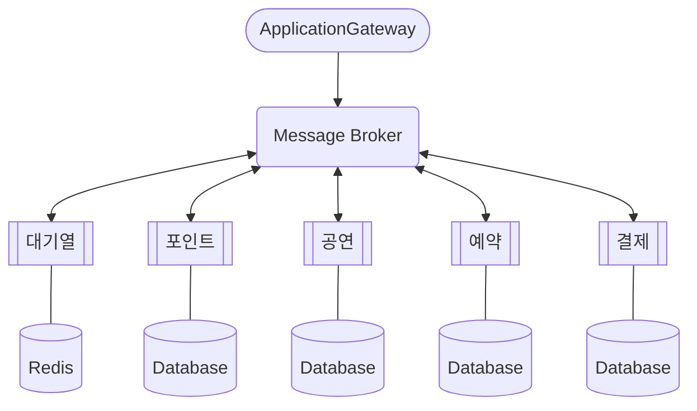
- MSA 패턴 : Choreography Saga 패턴 -> 현재 서비스의 복잡도가 높지 않지 않기 때문
- 트랜잭션 : Redis를 이용한 분산락을 통해 구현 -> Redis 통한 낙관락도 있지만 이슈 발생시 롤백 처리되는 케이스가 많을 것으로 예상해서 분산락을 선택
- 에러 이벤트 발생시 각 서비스에서 보상 트랜잭션을 통해 롤백 실행
### MSA 적용 이후의 트랜잭션
#### 결제 API
1. 예약 정보 검증
2. 결제 내역 생성
3. 결제 완료 생성 이벤트 발생
	1. 포인트
		2. 포인트 조회
		3. 포인트 차감
	2. 공연
		1. 공연 및 좌석 정보를 metadata로 저장
		3. 좌석 상태를 결제로 변경
	3. 예약
		1. 예약 상태를 결제로 변경
	4. 대기열
		1. 토큰 삭제
#### 보상 트랜잭션
1. 포인트, 공연 서비스에서 에러 발생시 실패 이벤트 발행
	- 포인트
		1. 포인트 조회
		2. 포인트 충전
	- 공연
		1. 좌석 상태를 예약으로 변경
	- 예약
		1. 예약 상태를 예약으로 변경
	- 대기열
		1. 해당 토큰 복구
