# Concert-Reservation-API

포인트를 충전하고 콘서트의 좌석을 예매하는 API

## 목차

- [Milestone](https://github.com/Ksanbal/Concert-Reservation-API/milestones)
- [Projects](https://github.com/users/Ksanbal/projects/8/views/1)
- [시퀀스 다이어그램](#시퀀스-다이어그램)
  - [대기열](#대기열)
    - [대기열 토큰 발급](#대기열-토큰-발급)
    - [대기열 토큰 유효성 체크](#대기열-토큰-유효성-체크)
    - [대기열 토큰 유효기간 연장](#대기열-토큰-유효기간-연장)
    - [대기열 토큰 상태 및 만료시간 업데이트 스케줄](#대기열-토큰-상태-및-만료시간-업데이트-스케줄)
  - [공연](#공연)
    - [예약가능 날짜 조회](#예약가능-날짜-조회)
    - [예약가능 자리 조회](#예약가능-자리-조회)
    - [공연 예약 요청](#공연-예약-요청)
    - [좌석 예약 반환 스케줄](#좌석-예약-반환-스케줄)
  - [결제](#결제)
  - [포인트](#포인트)
    - [포인트 잔액 조회](#포인트-잔액-조회)
    - [포인트 충전](#포인트-충전)
- [ERD](#erd)
- [API 명세서](#api-명세서)
- [Query 분석 및 캐싱 전략 설계](#query-분석-및-캐싱-전략-설계)

## 시퀀스 다이어그램

### 대기열

#### 대기열 토큰 발급

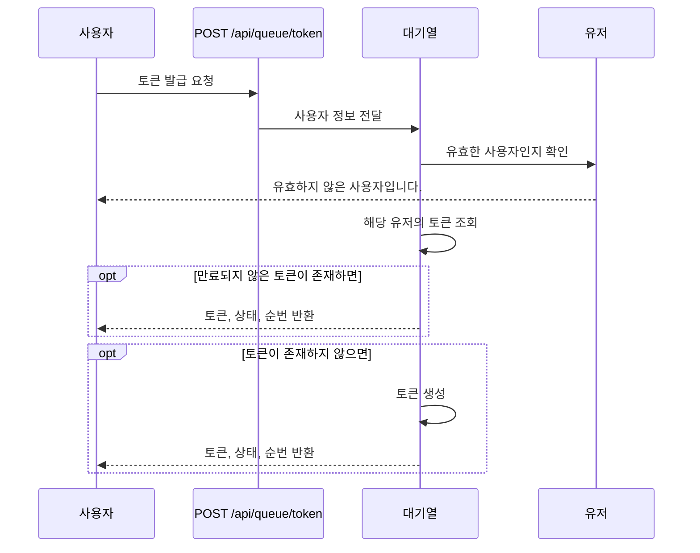

#### 대기열 토큰 유효성 체크

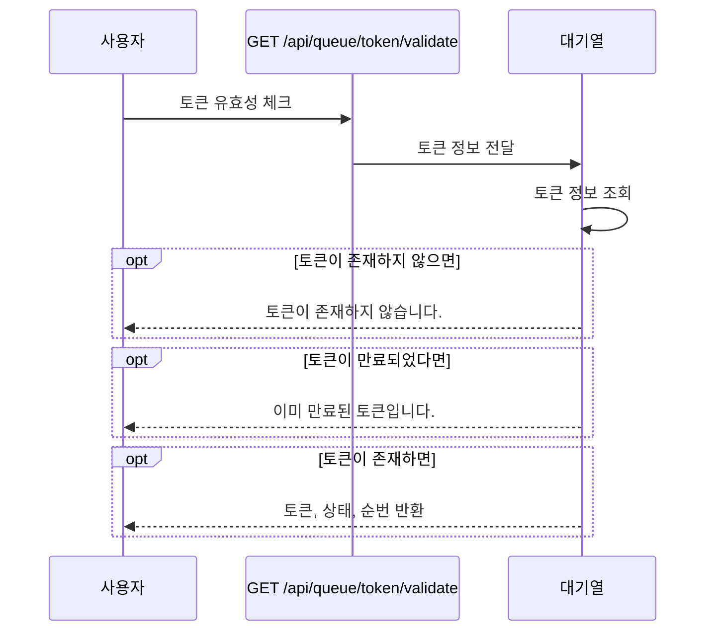

#### 대기열 토큰 유효기간 연장

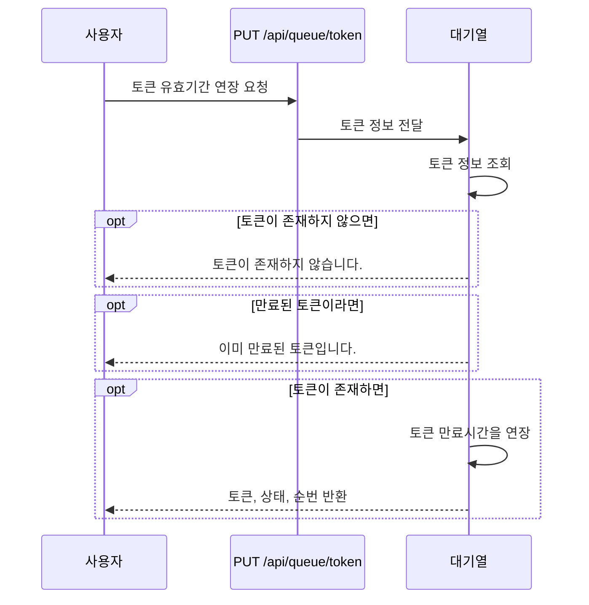

#### 대기열 토큰 상태 및 만료시간 업데이트 스케줄

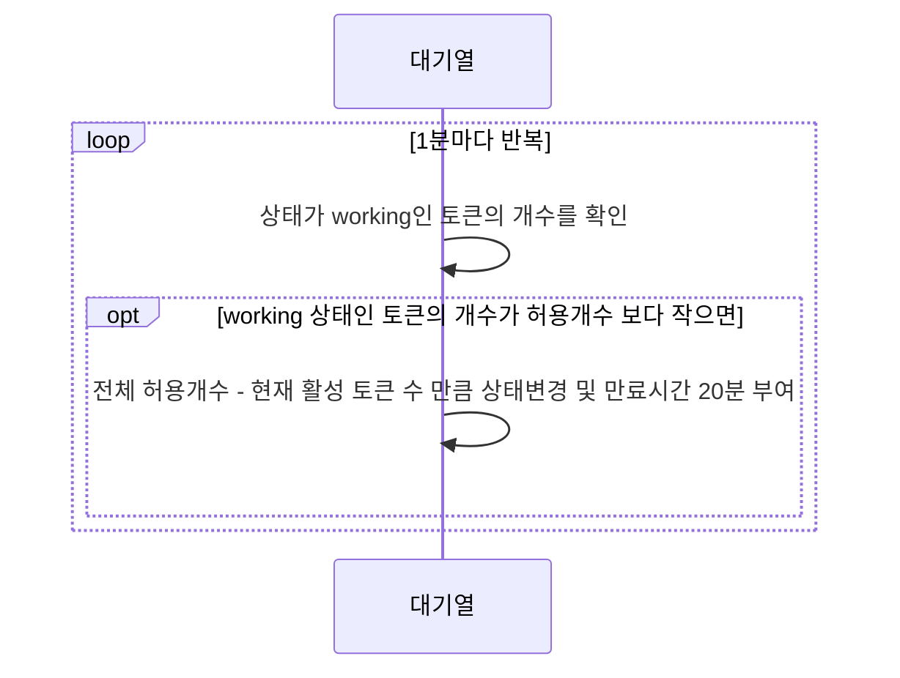

### 공연

#### 예약가능 날짜 조회

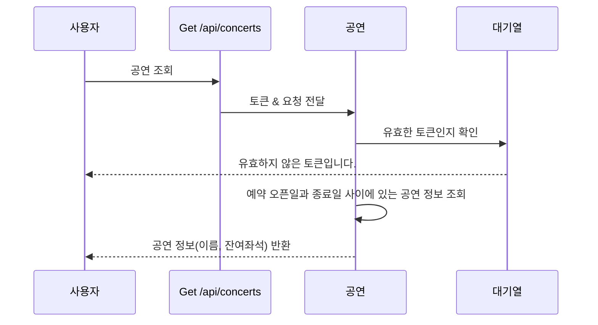

#### 예약가능 자리 조회

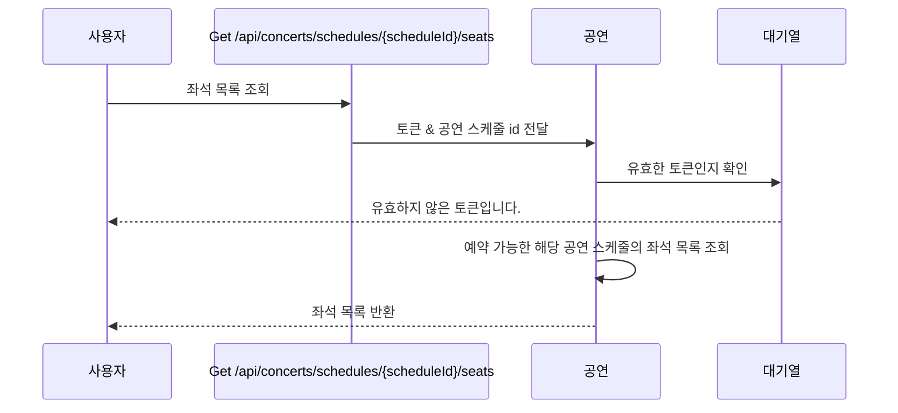

#### 공연 예약 요청

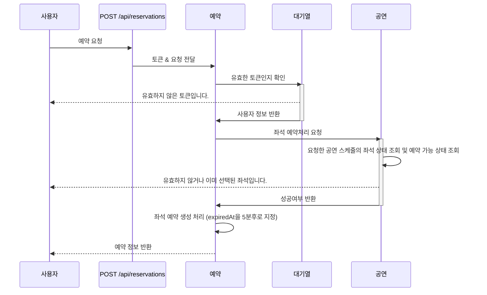

#### 좌석 예약 반환 스케줄


### 결제

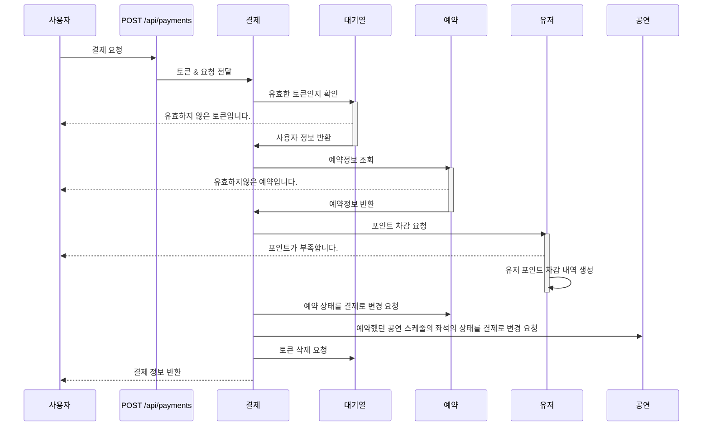

### 포인트

#### 포인트 잔액 조회

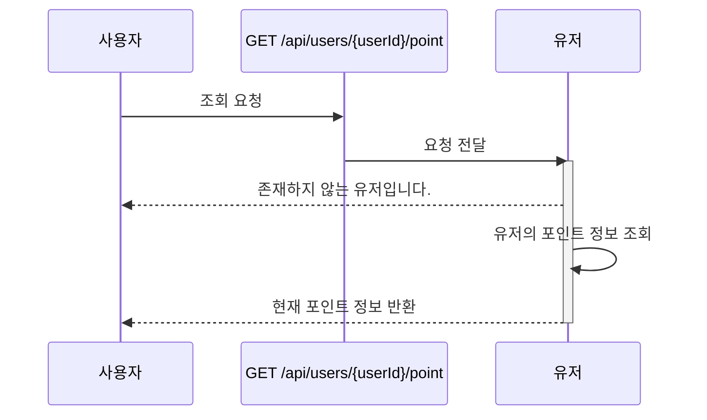

#### 포인트 충전

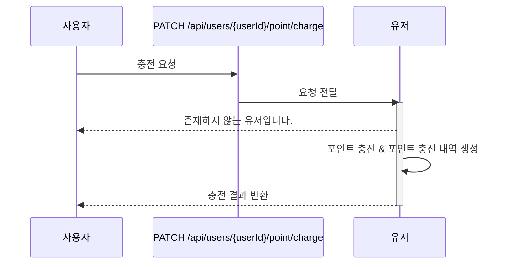

## ERD

| Table             | Verbose         | Description                         |
| ----------------- | --------------- | ----------------------------------- |
| user              | 사용자          | 사용자                              |
| queue             | 대기열          | 사용자의 대기열 토큰 정보           |
| point             | 포인트          | 사용자의 포인트 정보                |
| point_history     | 포인트 내역     | 포인트 충전, 사용 내역              |
| concert           | 공연            |                                     |
| concert_schedule  | 공연 스케줄     | 공연 날짜 및 잔여좌석 정보          |
| concert_seat      | 공연 좌석       | 공연 스케줄의 좌석 정보             |
| reservation       | 예약            | 사용자의 공연 예약 정보             |
| payment           | 결제정보        | 사용자의 공연 예약 정보             |
| concert_meta_data | 공연 메타데이터 | 공연 예약시 생성되는 공연 meta data |

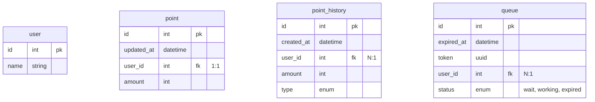

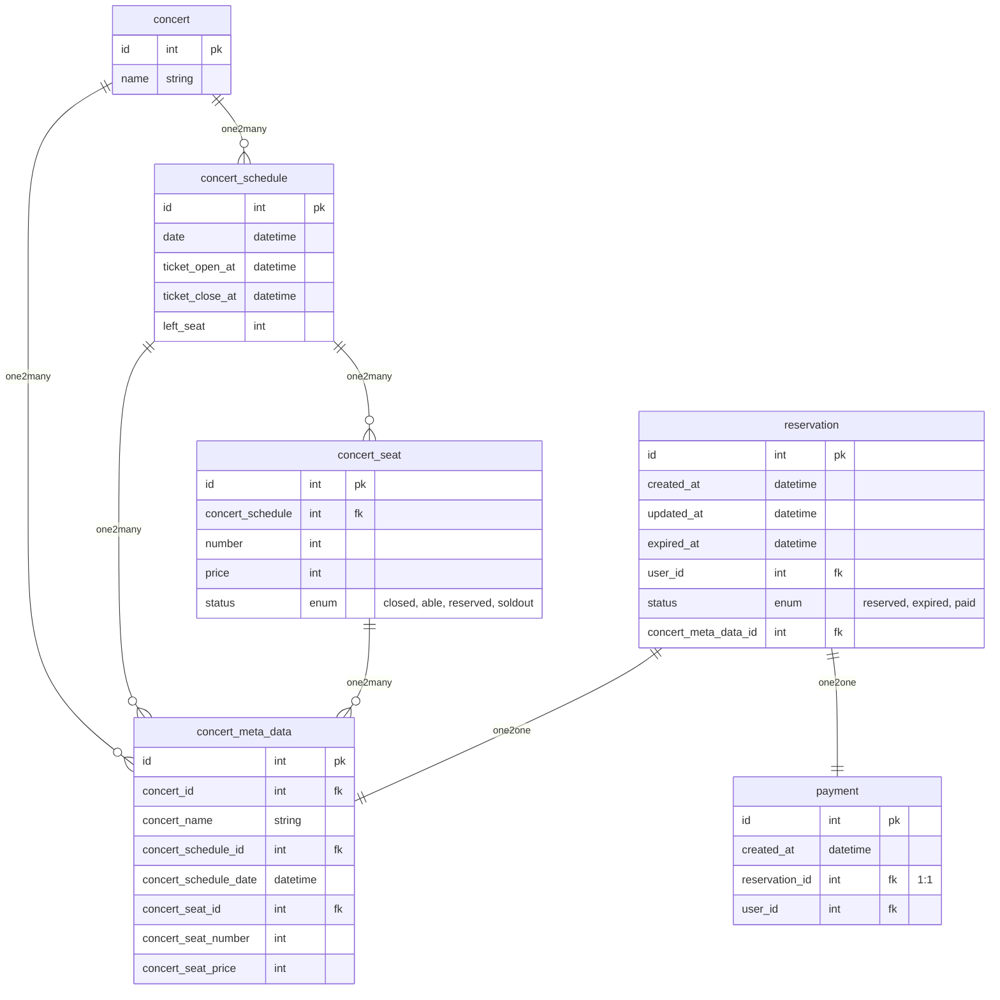

## API 명세서

**목차**

- 대기열
  - [대기열 토큰 발급](#대기열-토큰-발급-api)
  - [대기열 토큰 유효성 체크](#대기열-토큰-유효성-체크-api)
  - [대기열 토큰 유효기간 연장](#대기열-토큰-유효기간-연장-api)
- 공연
  - [예약 가능한 공연 날짜 조회](#예약-가능한-공연-날짜-조회-api)
  - [공연 좌석 조회](#공연-좌석-조회-api)
  - [공연 예약](#공연-예약-api)
- [공연 결제](#공연-결제-api)
- 포인트
  - [포인트 조회](#포인트-조회-api)
  - [포인트 충전](#포인트-충전-api)

### 대기열 토큰 발급 API

현재 유저에게 대기열 토큰을 발급합니다.

- `POST /api/queue/token`
- **Body**
  |Key|type|Description|
  |---|---|---|
  |userId|int|사용자 id|
- **Response**

  ```json
  // 201 Created
  {
    "token": "d07edb0f-3ac1-45a3-8972-7d263958b59d", // uuid
    "status": "wait", // wait, working
    "remain": 1
  }

  // 401 Unauthorized
  {
    "message": "유효하지 않은 사용자입니다."
  }
  ```

### 대기열 토큰 유효성 체크 API

현재 유저의 대기열 정보를 조회합니다.

- `GET /api/queue/token/validate`
- **Header**
  | Key | Description |
  | ------ | ----------- |
  | Authorization | 대기열 토큰 |
- **Response**

  ```json
  // 200 OK
  {
    "token": "d07edb0f-3ac1-45a3-8972-7d263958b59d", // uuid
    "status": "wait", // wait, working
    "remain": 1
  }

  // 404 Not Found
  {
    "message": "토큰이 존재하지 않습니다."
  }

  // 401 Unauthorized
  {
    "message": "이미 만료된 토큰입니다."
  }
  ```

### 대기열 토큰 유효기간 연장 API

현재 유저의 대기열 토큰의 유효기간을 연장합니다.

- `PUT /api/queue/token`
- **Header**
  | Key | Description |
  | ------ | ----------- |
  | Authorization | 대기열 토큰 |
- **Response**

  ```json
  // 200 OK
  {
    "token": "d07edb0f-3ac1-45a3-8972-7d263958b59d", // uuid
    "status": "wait", // wait, working
    "remain": 1
  }

  // 404 Not Found
  {
    "message": "토큰이 존재하지 않습니다."
  }

  // 401 Unauthorized
  {
    "message": "이미 만료된 토큰입니다."
  }
  ```

### 예약 가능한 공연 날짜 조회 API

예약 가능한 공연 목록을 조회합니다. 티켓 오픈날짜와 종료날짜로 검증합니다.

- `GET /api/concerts`
- **Header**
  | Key | Description |
  | ------ | ----------- |
  | Authorization | 대기열 토큰 |
- **Response**

  ```json
  // 200 OK
  [
    {
      "id": 1,
      "name": "카리나의 왁자지껄",
      "schedule": [
        {
          "id": 1,
          "date": "2023-04-12T14:30:00+09:00",
          "ticketOpenAt": "2023-04-12T14:30:00+09:00",
          "ticketCloseAt": "2023-04-12T14:30:00+09:00",
          "leftSeat": 50,
        }
      ]
    }
  ]

  // 401 Unauthorized
  {
    "message": "유효하지 않은 토큰입니다."
  }

  // 403 Forbidden
  {
    "message": "유효하지 않은 토큰입니다."
  }
  ```

### 공연 좌석 조회 API

해당 공연의 좌석 목록을 조회합니다.

- `GET /api/concerts/schedules/:scheduleId/seats`
- **Header**
  | Key | Description |
  | ------ | ----------- |
  | Authorization | 대기열 토큰 |
- **Path Parameter**
  | Key | Description |
  | ------ | ----------- |
  | scheduleId | 공연 스케줄 id |
- **Response**

  ```json
  // 200 OK
  [
    {
      "id": 1,
      "number": 1,
      "price": 50000,
      "status": "Able" // Able, Reserved, SoldOut
    }
  ]

  // 401 Unauthorized
  {
    "message": "유효하지 않은 토큰입니다."
  }

  // 403 Forbidden
  {
    "message": "유효하지 않은 토큰입니다."
  }
  ```

### 공연 예약 API

공연을 예약합니다.

- `POST /api/reservations`
- **Header**
  | Key | Description |
  | ------ | ----------- |
  | Authorization | 대기열 토큰 |
- **Request Body**
  | Key | Type | Description |
  | ------ | ----------- |-|
  | scheduleId | int | 공연 날짜 id |
  | seatId | int | 좌석 id |
  ```json
  {
    "scheduleId": 1,
    "seatId": 1
  }
  ```
- **Response**

  ```json
  // 201 Created
  {
    "id": 1,
    "createdAt": "2023-04-12T14:30:00+09:00",
    "updatedAt": "2023-04-12T14:30:00+09:00",
    "expiredAt": "2023-04-12T14:30:00+09:00",
    "status": "reserved", // reserved, expired, paid
    "concertMetaData": {
      "concertName": "카리나의 왁자지껄",
      "concertScheduleData": "2023-04-12T14:30:00+09:00",
      "concertSeatNumber": 1,
      "concertSeatPrice": 50000,
    }
  }

  // 400 Bad Request
  {
    "message": "이미 선택된 좌석입니다."
  }

  // 401 Unauthorized
  {
    "message": "유효하지 않은 토큰입니다."
  }

  // 403 Forbidden
  {
    "message": "유효하지 않은 토큰입니다."
  }
  ```

### 공연 결제 API

사용자가 예약한 공연을 결제합니다.

- `POST /api/payments`
- **Header**
  | Key | Description |
  | ------ | ----------- |
  | Authorization | 대기열 토큰 |
- **Body**
  | Key |Type| Description |
  | ------ | - | ----------- |
  |reservationId|int|예약 id|
- **Response**

  ```json
  // 201 Created
  {
    "id": 1,
    "createdAt": "2023-04-12T14:30:00+09:00",
    "reservation": {
      "id": 1,
      "createdAt": "2023-04-12T14:30:00+09:00",
      "updatedAt": "2023-04-12T14:30:00+09:00",
      "expiredAt": "2023-04-12T14:30:00+09:00",
      "status": "reserved", // reserved, expired, paid
      "concertMetaData": {
        "concertName": "카리나의 왁자지껄",
        "concertScheduleDate": "2023-04-12T14:30:00+09:00",
        "concertSeatNumber": 1,
        "concertSeatPrice": 50000,
      }
    },
  }

  // 400 Bad Request
  {
    "message": "포인트가 부족합니다."
  }

  {
    "message": "유효하지 않은 접근입니다."
  }

  // 401 Unauthorized
  {
    "message": "유효하지 않은 토큰입니다."
  }

  // 403 Forbidden
  {
    "message": "유효하지 않은 토큰입니다."
  }
  ```

### 포인트 조회 API

현재 유저의 포인트 정보를 조회합니다.

- `GET /api/users/:userId/point`
- **Path Parameter**
  | Key | Description |
  | ------ | ----------- |
  | userId | 사용자 id |
- **Response**
  ```json
  // 200 Ok
  {
    "amount": 100000
  }
  ```

### 포인트 충전 API

현재 유저의 포인트를 충전합니다.

- `PATCH /api/users/:userId/point/charge`
- **Path Parameter**
  | Key | Description |
  | ------ | ----------- |
  | userId | 사용자 id |
- **Request Body**
  | Key | Type | Description |
  | ------ | ----------- |-|
  | amount | int | 충전 금액 |
  ```json
  {
    "amount": 50000
  }
  ```
- **Response**

  ```json
  // 200 Ok
  {
    "amount": 100000
  }
  ```

---

# Query 분석 및 캐싱 전략 설계

## Slow Query가 발생할 수 있는 케이스

- Slow Query가 발생할 수 있는 경우
  - 대량의 데이터를 불러오는 경우
  - 전체 테이블 스캔이 발생하는 경우 (Join)
  - 잠금 문제 (비관락)
  - Index가 잘못 선정된 경우
- 콘서트 예약 서비스에서 Slow Query가 발생할 수 있는 API
  - 공연 목록 조회
    - 남은 좌석 수를 `select count(*) from schedule_seat where status=open`으로 처리하는 경우
    - 좌석은 예약에서 락이 발생하기 때문
    - status에 index가 없으면 조회 속도가 느릴 수 있기 때문
  - 공연 스케줄 좌석 조회
    - 좌석, 예약에 대한 비관적 락에 의한 경우

## N초마다 M개의 토큰을 Active Tokens으로 전환하기 위한 방정식

1. 한 유저가 콘서트 조회를 시작하고 결제까지 완료되는 시간을 파악
   1. 목록 조회 -> 좌석 조회 -> 예약 -> 포인트 충전 -> 결제
   2. **평균 1분**
2. DB에 동시에 접근할 수 있는 트래픽의 최대치를 계산
   1. TPS가 1000이라고 가정 -> 1분당 60,000
3. 1분간 유저가 호출하는 API의 수 2. 목록 조회, 좌석 조회, 예약, 포인트 충전, 결제 : **5** 3. 재시도 계수 : **2** 4. 총 호출 API 수 : **10**
4. 분당 처리할 수 있는 동시접속자 수
   1. `60,000 / 10` = 1분당 6,000명
   2. N = 10초마다 M = 1,000명씩 유효한 토큰으로 전환
   3. 나의 대기열 순번이 1,160,000번(브루노마스 티켓팅 동접자 수)이라면? -> 19분 18초
